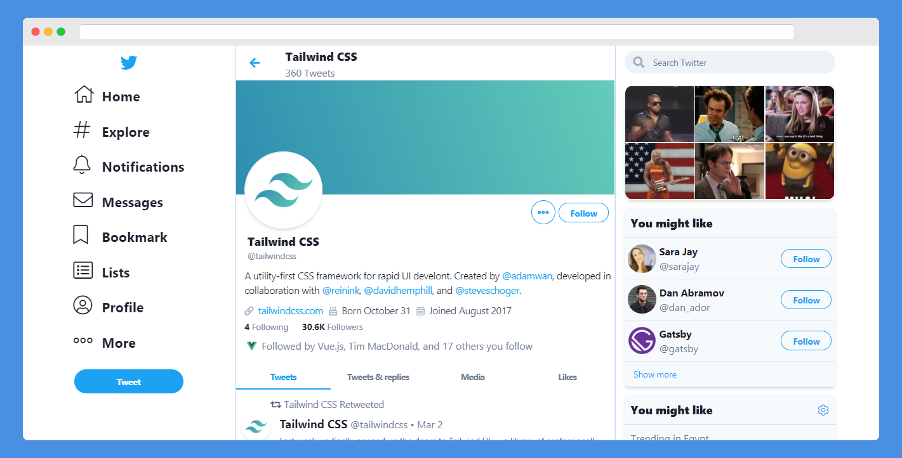
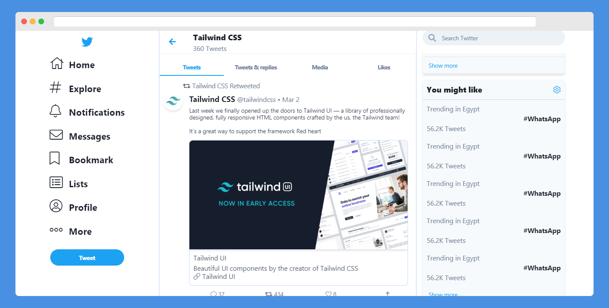
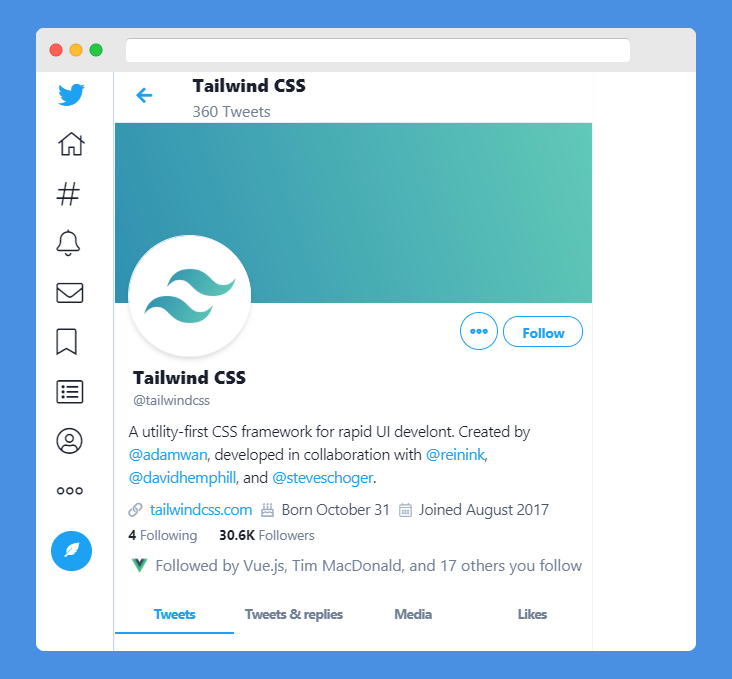

<!-- Graphics or Logo-->



<!-- Title and slug-->

# Twitter Clone

> Clone of the current [Twitter](https://twitter.com) created with [Tailwind CSS](https://tailwindcss.com)

<br>

**_Full screen_**

[]()

<br>

**_Small screen_**

[]()


---
## td;lr

> This project aims to duplicate only the design and the responsive behavior of current Twitter design for educational and reference purposes **aka _just for fun_**. If you are intrested please read the [Todo List](#todo-list) section.

> [Contributing](#contributing)  are welcome to complete this porject.

---

## Table of Contents

- [Twitter Clone](#twitter-clone)
  - [td;lr](#tdlr)
  - [Table of Contents](#table-of-contents)
  - [Features](#features)
  - [Getting started](#getting-started)
  - [Documentation](#documentation)
    - [Tailwind Config](#tailwind-config)
      - [Screen sizes](#screen-sizes)
    - [PostCss config](#postcss-config)
  - [Contributing](#contributing)
    - [Step 2](#step-2)
    - [Step 3](#step-3)
  - [Todo List](#todo-list)
  - [License](#license)

---

## Features

- [Tailwind CSS](https://tailwindcss.com)
- Almost typical to twitter
- Font Awesome pro (experimental)
- Fully responsive
- Mobile friendly


## Getting started

**I use yarn** 

- For development

  `yarn build` Or `yarn build --watch`

- For Production
    
    `yarn production`
---

## Documentation

### Tailwind Config

#### Screen sizes

```js
screens: {
			iphone5: '320px',
			xs: '320px',
			iphonex: '375px',
			iphonePlus: '414px',
			colbreak: '500px',
			sm: '640px',
			ipad: '768px',
			md: '768px',
			lg: '930px',
			ipadAir: '1024px',
			xl: '1024px',
			laptop: '1100px',
			'2xl': '1280px',
			'3xl': '1320px',
			laptopl: '1440px',
			colView: { min: '1px', max: '499px' },
			menubreak: { min: '931px', max: '1023px' },
			rightsidebreak: { min: '637px', max: '905px' },
			afterRightSideBreak: { min: '905px', max: '929px' },
		},
```

**__Note: Order of sizes matters__**


### PostCss config

`cat css/*.css | postcss > ./public/build/styles.css`

Postcss will compile fontawsome (fa.css) and (tailwind.css) into one minified bundle (styles.css)

 - **In production `yarn production`**
    - PurgeCss
    - cssnano

will minifiy the whole bundle into 12kb!

---


## Contributing

> To get started...

- Take a quick look on [Todo List](#todo-list)
- Open issue to share and discuses new ideas or features.

### Step 2
  - Fork this repo!
  - Commit to the [develop](https://github.com/nagi1/twitter-clone/tree/develop) branch

- **Do your thing.**

### Step 3

- Create a new pull request

---

## Todo List

- [ ] Add NPM support
- [ ] Edit the Readme.md
- [ ] Create community
- [ ] Unify screen sizes
- [ ] Move to [Material Icons](https://material.io/resources/icons/)
- [ ] Fix button sizes
- [ ] Fix Mobile version
- [ ] Extract to vue components
- [ ] un-Spaghetti the code!
- [ ] Add setting page
- [ ] Add more tweet cards
- [ ] Add direct messages page 

---


## License

[](http://badges.mit-license.org)